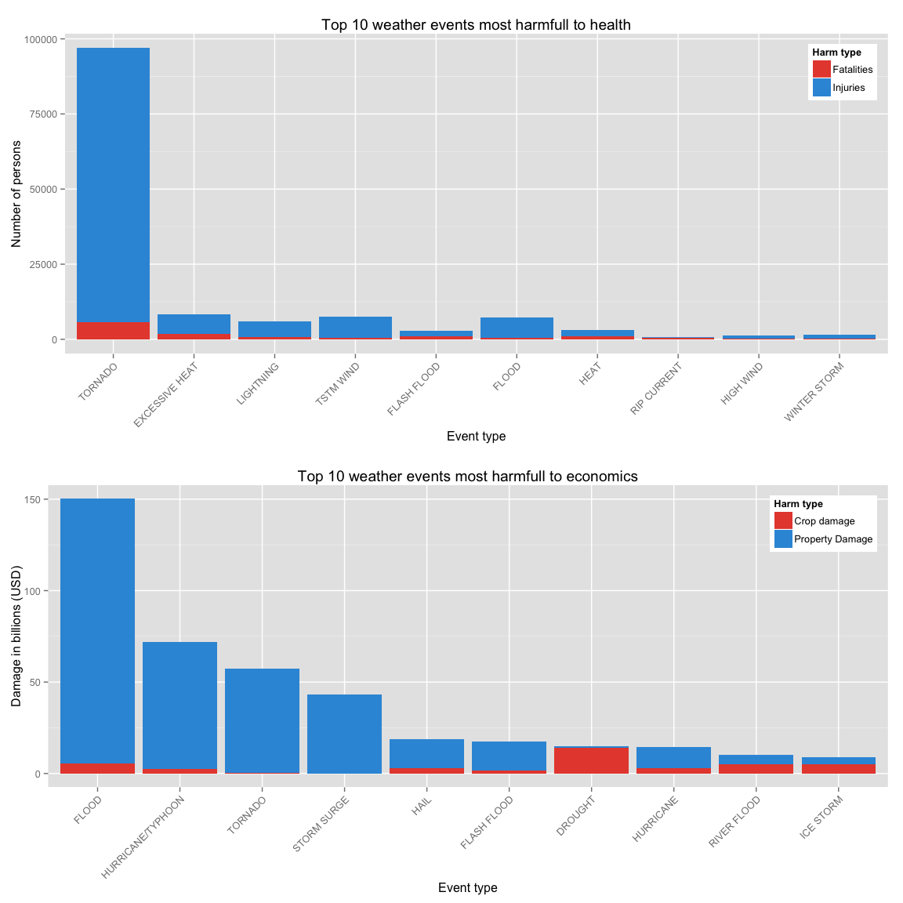
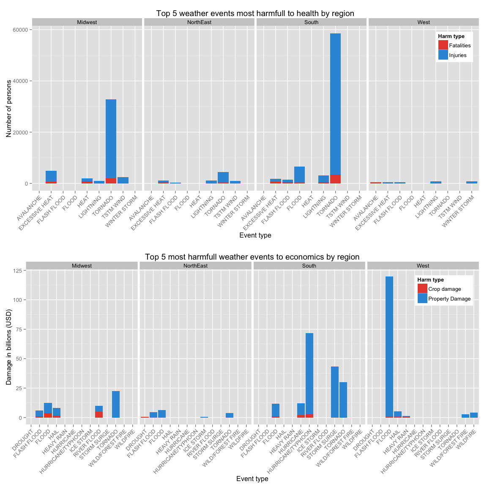

# Exploratory analysis on the impact of weather events to public health and economics in the United States from 1950 to 2011
### *Lou Marvin Caraig*


## Synopsis

The analysis takes in account the U.S. National Oceanic and Atmospheric Administration's (NOAA)
database that tracks the effects of wheather events in terms of fatalities and injuries
(public health damages) and in terms of property and crop damages (economical damages).

The purpose of the analsys is to address the following questions:

1. Across the United States, which types of events (as indicated in the EVTYPE variable)
are most harmful with respect to population health?
2. Across the United States, which types of events have the greatest economic consequences?

The analysis starts by retrieving the total numbers of fatalities, injuries, property damages
and crop damages for each weather event across the United States. After that the same analysis
is performed but also grouping by region (`West`, `Midwest`, `South`, `NorthEast`) to verify if
the results are different.


## Data processing

The data comes from U.S. National Oceanic and Atmospheric Administration's (NOAA) storm
database which tracks characteristics of major storms and weather events in the
United States, including when and where they occur, as well as estimates of any fatalities,
injuries, property damages and crop damages. The data are obtained from [here][downloadLink].

For the data processing we use `dplyr` and `tidyr`, for the data visualization
we use `ggplot2` and `gridExtra` and `knitr` for printing tables.


```r
library(dplyr, warn.conflicts=FALSE)
library(tidyr)
library(ggplot2)
library(gridExtra)
library(knitr)
```

[downloadLink]: https://d396qusza40orc.cloudfront.net/repdata%2Fdata%2FStormData.csv.bz2

### Downloading and reading data

First of all we download the data from the above provided link and saved it in the
current directory by naming it `stormData.csv.bz2`. Now we can load the data (it may take
a long time for loading it).


```r
rawDt <- read.csv('stormData.csv.bz2')
```

### Preprocessing

This dataset has a lot of columns so we first drop those we are not interested in, and we
rename the remaining ones.


```r
dt <- rawDt %>%
    select(state=STATE, evtype=EVTYPE,
           fatalities=FATALITIES, injuries=INJURIES,
           propertyDamage=PROPDMG, propertyDamangeExp=PROPDMGEXP,
           cropDamage=CROPDMG, cropDamageExp=CROPDMGEXP)
```

The values of `propertyDamage` and `cropDamage` are to be multiplied by a factor given by
`propertyDamageExp` and `cropDamageExp` respectively. The multiplier factor can be one of
`k`, `m` and `b` (case-insensitive) which mean `*10^3`, `*10^6` and `*10^9` resepectively.


```r
calcMultiplier <- function(multipliers) {
    sapply(multipliers, function(v) {
        ifelse(v %in% c('k', 'K'), 10**3,
        ifelse(v %in% c('m', 'M'), 10**6,
        ifelse(v %in% c('b', 'B'), 10**9, 0)))})
}

dt <- dt %>%
    mutate(propertyDamangeExp=calcMultiplier(propertyDamangeExp),
           cropDamageExp=calcMultiplier(cropDamageExp),
           propertyDamage=propertyDamage * propertyDamangeExp,
           cropDamage=cropDamage * cropDamageExp) %>%
    select(-propertyDamangeExp, -cropDamageExp)
```

We add a column `region` that can be one between `NorthEast`, `Midwest`, `South` and `West`
that can be useful for the analysis.


```r
calcRegion <- function(states) {
    as.factor(sapply(states, function(v) {
        switch(as.character(v),
               CT='NorthEast', ME='NorthEast', MA='NorthEast', NH='NorthEast',
               RI='NorthEast', VT='NorthEast', NJ='NorthEast', NY='NorthEast',
               PA='NorthEast',
               IL='Midwest', IN='Midwest', MI='Midwest', OH='Midwest', WI='Midwest',
               IA='Midwest', KS='Midwest', MN='Midwest', MO='Midwest', NE='Midwest',
               ND='Midwest', SD='Midwest',
               DE='South', FL='South', GA='South', MD='South', NC='South', SC='South',
               VA='South', WV='South', AL='South', KY='South', MS='South', TN='South',
               AR='South', LA='South', OK='South', TX='South',
               AZ='West', CO='West', ID='West', MT='West', NV='West', NM='West', UT='West',
               WY='West', AK='West', CA='West', HI='West', OR='West', WA='West',
               'Unknown')
    }))
}

dt <- dt %>% mutate(region=calcRegion(state))
```

In order to sort the event types we use a function to calculate the *harmfullness score*.
We consider two different scores: `healthHarmfulnessScore` and `economicHarmfulnessScore`.
The first one is to measure the impact to the public health and correspond to
the weighted mean between the total number of fatalities weighted 10, and the total number
of injuries weighted 1.
The second one is to measure the impact to the economics and correspond to
the weighted mean between the total property damage and the total crop damage both weighted 1
(same as mean).
So we add the these columns and we keep only the observations with a score greater than zero.


```r
calcHealthHarmfulnessScore <- function(fatalities, injuries) {
    apply(cbind(fatalities, injuries), 1, function(v) {weighted.mean(v, c(10, 1))})
}

calcEconomicHarmfulnessScore <- function(propertyDamage, cropDamage) {
    apply(cbind(propertyDamage, cropDamage), 1, function(v) {weighted.mean(v, c(1, 1))})
}

dt <- dt %>%
    mutate(healthHarmfulnessScore=calcHealthHarmfulnessScore(fatalities, injuries),
           economicHarmfulnessScore=calcEconomicHarmfulnessScore(propertyDamage, cropDamage)) %>%
           filter(healthHarmfulnessScore > 0 | economicHarmfulnessScore > 0)
```


## Results

### Analysis of the events across the United States

After the initial preprocessing we now summarize our data by grouping by `evtype`.


```r
summarizeDt <- function(dt, ...) {
    dt %>%
        group_by(...) %>%
        summarize(totalFatalities=sum(fatalities), totalInjuries=sum(injuries),
                  totalPropertyDamage=sum(propertyDamage), totalCropDamage=sum(cropDamage),
                  count=n(),
                  healthHarmfulnessScore=sum(healthHarmfulnessScore),
                  economicHarmfulnessScore=sum(economicHarmfulnessScore))
}

dtSummarized <- dt %>% summarizeDt(evtype)
```

We can now retrieve and plot the top 10 event types in terms of harmfullness.
To find the most harmfull wheather events to the public health we get those with the highest
`healthHarmfulnessScore` while to find the most harmfull to the economics we get those with
the highest `economicHarmfulnessScore`.


```r
dtHealth <- dtSummarized %>%
    select(-contains('Crop'), -contains('Property'), -contains('economic')) %>%
    top_n(10, healthHarmfulnessScore) %>%
    arrange(-healthHarmfulnessScore) %>%
    mutate(evtype=factor(evtype, levels=unique(evtype)))
dtEconomic <- dtSummarized %>%
    select(-contains('Fatalities'), -contains('Injuries'), -contains('health')) %>%
    top_n(10, economicHarmfulnessScore) %>%
    arrange(-economicHarmfulnessScore) %>%
    mutate(evtype=factor(evtype, levels=unique(evtype)),
           totalPropertyDamage=totalPropertyDamage / 10**9,
           totalCropDamage=totalCropDamage / 10**9)
```

Before the plotting some transformations are performed in order to make the datafareme suitable
for plotting a bar plot. The unit of measurement for economical damages is also changed to
billions of dollars.


```r
barPlot <- function(dt, title, xlab, ylab, legendBreaks, legendLabels) {
    ggplot(dt, aes(evtype, total, fill=harmType)) +
        geom_bar(stat='identity', position='stack') +
        theme(axis.text.x=element_text(angle=45, hjust=1), legend.position=c(1, 1),
              legend.justification=c(1, 1)) +
        scale_fill_manual(name='Harm type', values=c('#e74c3c', '#3498db'),
                          breaks=legendBreaks, labels=legendLabels) +
        xlab(xlab) + ylab(ylab) + ggtitle(title)
}

healthBarPlot <- function(dtHealth) {
    dtHealth %>%
        select(fatalities=totalFatalities, injuries=totalInjuries,
               evtype, healthHarmfulnessScore) %>%
        gather(harmType, total, -evtype, -healthHarmfulnessScore) %>%
        barPlot('Top 10 weather events most harmfull to health',
                'Event type', 'Number of persons', c('fatalities', 'injuries'),
                c('Fatalities', 'Injuries'))
}

economicBarPlot <- function(dtEconomic) {
    dtEconomicPlot <- dtEconomic %>%
        select(cropDamage=totalCropDamage, propertyDamage=totalPropertyDamage,
               evtype, economicHarmfulnessScore) %>%
        gather(harmType, total, -evtype, -economicHarmfulnessScore) %>%
        barPlot('Top 10 weather events most harmfull to economics',
                'Event type', 'Damage in billions (USD)',
                c('cropDamage', 'propertyDamage'), c('Crop damage', 'Property Damage'))
}

healhtPlot <- healthBarPlot(dtHealth)
economicPlot <- economicBarPlot(dtEconomic)

grid.arrange(healhtPlot, economicPlot, nrow=2)
```

 

### Analysis of the events across the United States by region

It is interesting to see if the most harmfull events change if we perform the analysis
also by grouping by region. We can perform this analysis very similary to what we have
just performed. The data are slightly different as we filter out those observations
whose region is unknown. For this analysis we consider the top 5 events per region.


```r
dtSummarizedRegion <- dt %>%
    filter(region != 'Unknown') %>%
    summarizeDt(evtype, region)

dtHealthRegion <- dtSummarizedRegion %>%
    select(-contains('Crop'), -contains('Property'), -contains('economic')) %>%
    group_by(region) %>%
    top_n(5, healthHarmfulnessScore) %>%
    arrange(-healthHarmfulnessScore)

dtEconomicRegion <- dtSummarizedRegion %>%
    select(-contains('Fatalities'), -contains('Injuries'), -contains('health')) %>%
    group_by(region) %>%
    top_n(5, economicHarmfulnessScore) %>%
    arrange(-economicHarmfulnessScore) %>%
    mutate(totalPropertyDamage=totalPropertyDamage / 10**9,
           totalCropDamage=totalCropDamage / 10**9)

barPlotRegion <- function(dt, title, xlab, ylab, legendBreaks, legendLabels) {
    barPlot(dt, title, xlab, ylab, legendBreaks, legendLabels) + facet_grid(. ~ region)
}

healthBarPlotRegion <- function(dtHealthRegion) {
    dtHealthRegion %>%
        select(fatalities=totalFatalities, injuries=totalInjuries, evtype, region,
               healthHarmfulnessScore) %>%
        gather(harmType, total, -evtype, -region, -healthHarmfulnessScore) %>%
        barPlotRegion('Top 5 weather events most harmfull to health by region',
                      'Event type', 'Number of persons', c('fatalities', 'injuries'),
                      c('Fatalities', 'Injuries'))
}

economicBarPlotRegion <- function(dtEconomic) {
    dtEconomicRegion %>%
        select(cropDamage=totalCropDamage, propertyDamage=totalPropertyDamage, evtype,
               region, economicHarmfulnessScore) %>%
        gather(harmType, total, -evtype, -region, -economicHarmfulnessScore) %>%
        barPlotRegion('Top 5 most harmfull weather events to economics by region',
                      'Event type', 'Damage in billions (USD)',
                      c('cropDamage', 'propertyDamage'), c('Crop damage', 'Property Damage'))
}

healhtPlotRegion <- healthBarPlotRegion(dtHealthRegion)
economicPlotRegion <- economicBarPlotRegion(dtEconomicRegion)

grid.arrange(healhtPlotRegion, economicPlotRegion, nrow=2)
```

 


## Conclusions

### Impact to public health

The most harmfull weather event across the United States is `TORNADO` with a
total number of 5633 fatalities
and 91346 injuries. `TORNADO`s are
greatly more harfmull than the other events such as `EXCESSIVE HEAT` which is in
second place with 1903
fatalities and 6525
injuries, and `LIGHTNING` which is in third place with
816 fatalities and
5230 injuries.
In the first plot is possible to see how much `TORNADO`s are cleary the most harmfull events
to public health.

By grouping by region `TORNADO`s are the most harmfull events in `South`, in `Midwest`
and in `NorthEast` while in `West` the most harmfull events are `AVALANCHE`s.

Here are in detail the top 5 for the `Midwest`, `NorthEast`, `South` and `West` regions
in order. Each table is ordered by event type harmfullness decreasingly.


```r
transpose <- function(dt) {
    dt.T <- t(dt[,2:ncol(dt)])
    colnames(dt.T) <- dt$evtype
    dt.T
}

printTableHealth <- function(dt, reg) {
    kable(ungroup(dt) %>%
          filter(region==reg) %>%
          arrange(-healthHarmfulnessScore) %>%
          select(evtype, Fatalities=totalFatalities, Injuries=totalInjuries) %>%
          transpose())
}
```


```r
printTableHealth(dtHealthRegion, 'Midwest')
```

              TORNADO   EXCESSIVE HEAT   HEAT   TSTM WIND   LIGHTNING
-----------  --------  ---------------  -----  ----------  ----------
Fatalities       1886              594    702         160         159
Injuries        30941             4232   1262        2339         866

```r
printTableHealth(dtHealthRegion, 'NorthEast')
```

              TORNADO   EXCESSIVE HEAT   LIGHTNING   TSTM WIND   FLASH FLOOD
-----------  --------  ---------------  ----------  ----------  ------------
Fatalities        219              492          76          77           101
Injuries         4169              621        1048         935           257

```r
printTableHealth(dtHealthRegion, 'South')
```

              TORNADO   FLOOD   EXCESSIVE HEAT   LIGHTNING   FLASH FLOOD
-----------  --------  ------  ---------------  ----------  ------------
Fatalities       3500     206              613         431           490
Injuries        55047    6391             1096        2586           984

```r
printTableHealth(dtHealthRegion, 'West')
```

              AVALANCHE   LIGHTNING   EXCESSIVE HEAT   FLASH FLOOD   WINTER STORM
-----------  ----------  ----------  ---------------  ------------  -------------
Fatalities          220         140              184           161             89
Injuries            164         712              260           344            696

### Impact to economics

On the other hand the type of weather event that has the highest impact on ecomics is `FLOOD`
with a total of ~145 billion
dollars of property damage and
~6 billion dollars of crop
damage. `FLOOD`s are followed by `HURRICANE/TYPHOON`s with
~69 billion dollars
of property damage and ~3
billion dollars of crop damage, `TORNADO`s with
~57 billion dollars
of property damage and ~415
million dollars of crop damage.

By grouping by region the scenario is different. `FLOOD`s are the most harmfull to economics
only in `NorthEast` and `West` while in `Midwest` and `South` are `TORNADO`s and
`HURRICANE/TYPHOON`s respectively.

Here are in detail the top 5 for the `Midwest`, `NorthEast`, `South` and `West` regions
in order. Each table is ordered by event type harmfullness decreasingly.


```r
printTableEconomic <- function(dt, reg) {
    kable(ungroup(dt) %>%
          filter(region==reg) %>%
          arrange(-economicHarmfulnessScore) %>%
          select(evtype, `Property Damage`=totalPropertyDamage,
                 `Crop Damage`=totalCropDamage) %>%
          transpose())
}
```


```r
printTableEconomic(dtEconomicRegion, 'Midwest')
```

                      TORNADO      FLOOD   RIVER FLOOD       HAIL   FLASH FLOOD
----------------  -----------  ---------  ------------  ---------  ------------
Property Damage    22.4578686   8.806530      5.080905   6.451396     5.2035404
Crop Damage         0.1194902   3.799456      5.022584   1.800628     0.8022694

```r
printTableEconomic(dtEconomicRegion, 'NorthEast')
```

                      FLOOD   FLASH FLOOD    TORNADO    DROUGHT   ICE STORM
----------------  ---------  ------------  ---------  ---------  ----------
Property Damage    6.148491      4.452846   3.716512   0.000005    0.578952
Crop Damage        0.019240      0.019570   0.008224   0.719600    0.008550

```r
printTableEconomic(dtEconomicRegion, 'South')
```

                   HURRICANE/TYPHOON   STORM SURGE      TORNADO   HURRICANE       FLOOD
----------------  ------------------  ------------  -----------  ----------  ----------
Property Damage            69.033100     43.281360   29.8685764    9.907848   10.436738
Crop Damage                 2.603501      0.000005    0.2789392    2.189930    1.133034

```r
printTableEconomic(dtEconomicRegion, 'West')
```

                         FLOOD       HAIL    WILDFIRE   WILD/FOREST FIRE   HEAVY RAIN
----------------  ------------  ---------  ----------  -----------------  -----------
Property Damage    119.1395610   4.660423   3.9964420          2.6010650    0.5739176
Crop Damage          0.6622375   0.561866   0.1249014          0.1030946    0.7068108
